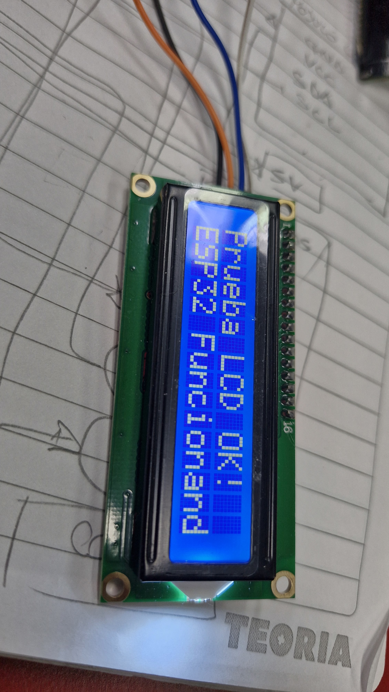
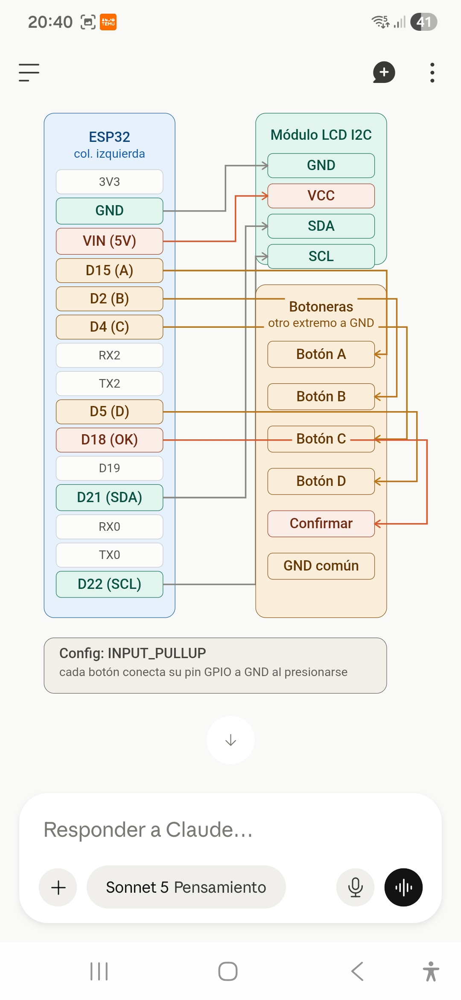
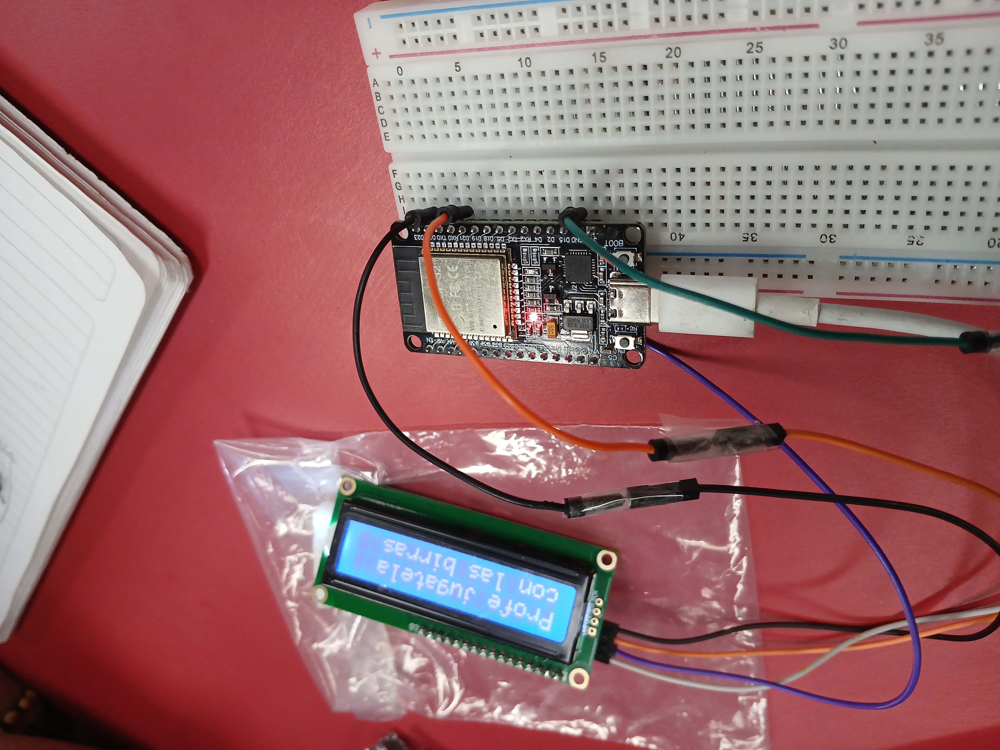
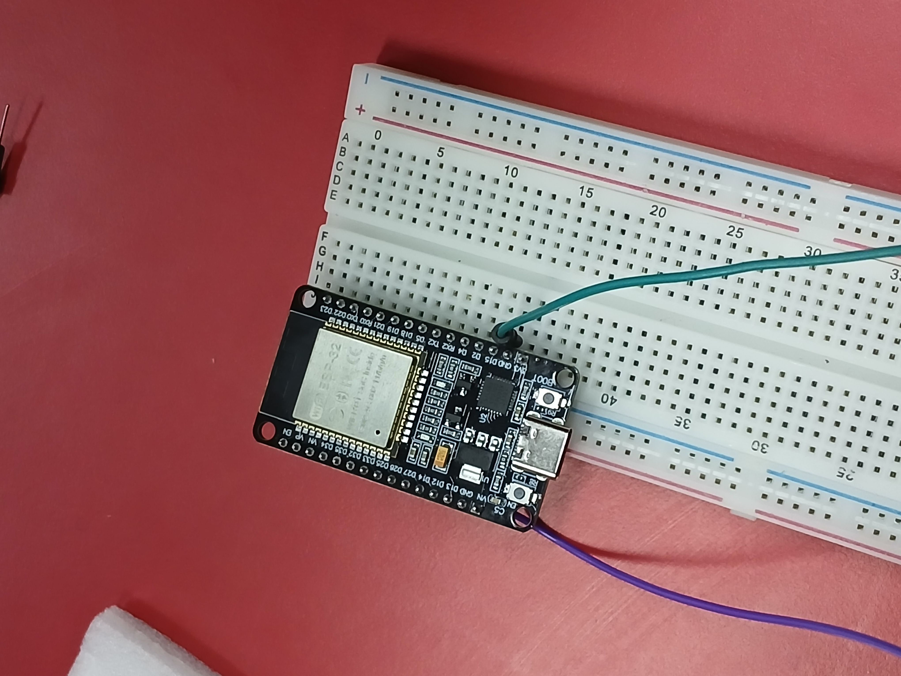
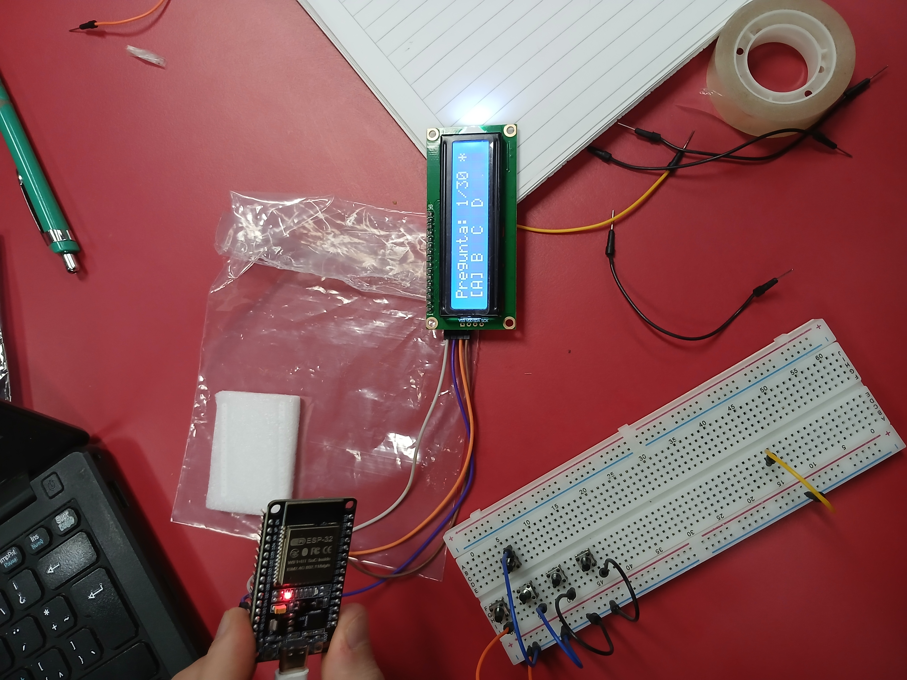

## Aclaraciónes del desarrollo documentativo del proyecto

| **Miembro** | **Rol** | **Descripción** |
|:---:|:---:|:---:|
| Elian Gutierrez | Documenter & investigador | Encargado de la documentación e investigación referente al proyecto |
| Agustin Silva | Investigador & Tester | Encargado de la investigación referente al proyecto y el testing de los diagramas y código |
| Nicolas Rodriguez | Orquestador & programador | Encargado de la orquesta de procesos y programación según los requerimientos funcionales |
| Richard Rodriguez | Electrónica & Soldadura | Encargado de la orquesta de procesos de electrónica aplicada y componentes |

## 12/8/2026

En ésta clase realizamos un estudio de mercado conjunto con todos los integrantes del equipo para reconocer componentes, precios, calidad y compatibilidad en relación al objetivo del proyecto.

### Tareas completadas

- Buscamos y comparamos precios de componentes.
- Confirmamos el objetivo del proyecto.
- Repartimos tareas según habilidades.

### Problemas encontrados y soluciones/alternativas propuestas

- Planteamos la solución según las distintas plataformas a disposición `microbit`, `arduino uno` y `esp-32`
- Incompatibilidad de componentes

  Encontramos que usar microbit planteaba una arquitectura de nodos conectados a un gateway.
  El problema no es la arquitectura sino que la capacidad limitada de envío y recepción de
  datos por segundo que tiene la antena de radio de micro:bit, lo cual retrasaría y
  plantearía una solución más compleja fuera del alcance de proyecto.

#### Soluciónes alternativas

barajamos las pataformas de arduino uno y esp 32, en primer lugar tomamos arduino uno por su adaptabilidad y ecosistema existente el cual nos proporciona un gran soporte en cuanto a librerias y tutoriales.

De cualquier forma deberíamos invertir en un modulo extra que nos sirva como antena entre cada nodo y el gateway, de ésta forma se sigue compejizando por incorporar modulos extras.

#### Solución final

Utilizamos esp-32 con el protocolo esp-now para conectar los dispositivos nodos directamente a una coputadora que procese los datos de entrega del examen de cada dispositivo. De ésta forma planteamos una arquitectura más simple donde cada nodo se coneta directamente a una pc/laptop apuntando a su dirección MAC mediante el protocolo esp-now, así cuando los alumnos terminen el examen el resultado se envía directamente, sin intermediarios que retrasen el envío de datos y fecilite la escalabilidad cuando existan +50 nodos.

### Próximos pasos

Nos vamos a poner manos a la obra plazmando el diagrama en la vida real.

## 19/8/2026

En ésta clase nos ponemos manos a la obra, comenzamos los diagramas, el armado y primeros testeos

## Tareas completadas

- Primer testeo del lcd 1602 alimentada con el esp-32
- Primeros diagramas de conección del lcd 1602 con el esp-32
- Versión de [prueba del código en c++](../codigo%20de%20prueba/ejemplo.c++)

## Problemas encontrados y soluciones/alternativas propuestas

### Compatibilidad

Desde el primer momento encontramos problemas en la compatibilidad entre las coputadoras con ide `Thonny` y `Arduino UNO` en relación al reconocimiento del esp-32 donde ejecutamos el código en micro python.

### Solución de compatibilidad

Tuvimos que instalar un driver de compatibilidad entre el esp-32 y las laptops llamado `CP210X UNIVERSAL WINDOWS`.

- Además de ésto implementamos el diagrama completo del esp32, el lcd 1602 I2C y la botonera:

### Próximos pasos

- Manos a la obra con el modelado del circuito electrónico sobre protoboard.
- Ejecución del código en el esp32.
- Interactuar LCD 1206 I2C con el esp32 mediante código.

## 26/8/2026

- Hoy testeamos el codigo, resolvimos problemas de conecciónes, planteamos ññ

### Problemas encontrados y soluciones/alternativas propuestas

#### Problema ####

- <u>1.0</u> El esp32 no entra en una protoboard completa, es necesario para tener disponible todos los pines.
- <u>2.0</u> El lcd 1602 no refleja los cambios del código del esp32.
  

### Soluciónes alternativas

- <u>1.0</u> pusimos el esp32 en la parte que necesitamos contectar más pines y del otro lado conectamos con cables hembra:
  
  <i>esp32 conectado para funcionar</i>

- <u>2.0</u> Fallo de la conección del pin `SCL` del lcd con el pin `d22` del esp32, el problema estaba en un falso contacto de un cable flojo que hacía la conección. Lo solucionamos conecandolo directamente al esp32 cambiandole el cable en mal estado por uno en buen estado.
  

### Próximos pasos

Sincronizar esp32 con pc laptop para envío de json y html.

## 02/8/2026

### Problemas encontrados

***1.0*** Problemas en la conección de redes.

Surgen problemas en la conección entre el esp32 y el dispositio que va a recepcionar el resultado

### Soluciones alternativas

***1.0*** Enlace directo desde el esp32 al dispositivo

Enlazamos directamente el esp32 mediante un punto hostpot al dispositivo que va a recibir las respuestas de los examenes, de ésta forma evitamos las restricciónes del wifi ceibal, el cual bloquea muchos puertos y protocoles en la red.

### Avances 

Nuevo programa monolito que gestiona (lcd 1602 + gestion del esp32 + de la recepción de las respuestas del examen) en [código completo v1.0 c++](../codigo%20de%20prueba/CodigoCompleto-Conexion.c++).

### Tareas completadas
  
  Implementamos una vista tipo página web para el control del profesor:

[Agregar nuevo alumno](../imagenes_proyecto/image%20(1).png)
  *** (Agregar nuevo alumno) ***
[Configuracion de la materia y examen](../imagenes_proyecto/image%20(2).png)
  *** (Configuración de la materia y examen) ***
[Control Examen](../imagenes_proyecto/image%20(3).png)
  *** (Establece las respuestas correctas y espera el resultado del examen) ***
[Agregar nuevo alumno](../imagenes_proyecto/image.png)
  *** (Ver las notas globales de cada alumno en el examen) ***

  
  
  - [Problemas encontrados y soluciones/alternativas propuestas]
  - [Próximos pasos]
  - [Imágenes o videos ilustrativos del avance]

## Nota

En este enlace encontrarás un [ejemplo como debe completarse el informe de avance](avance_ejemplo.md).