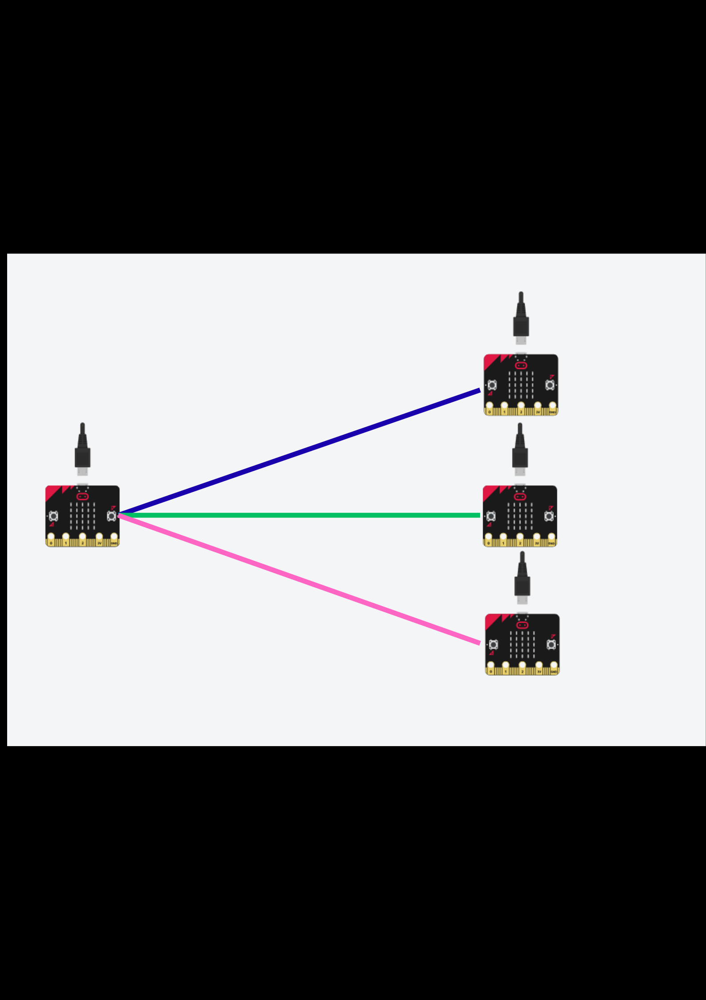
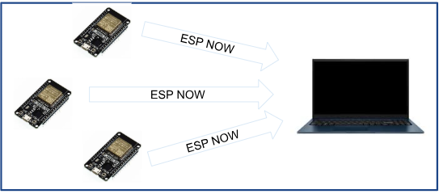
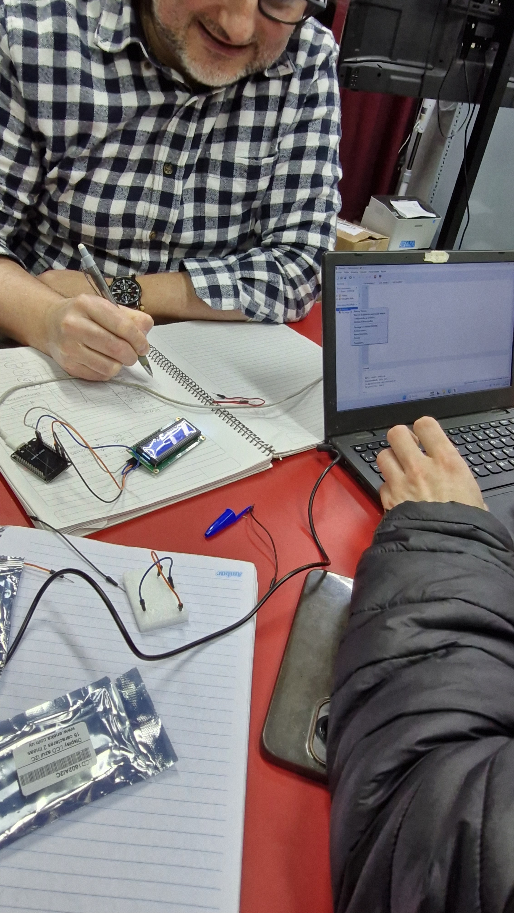

Informe de Avance 1: Agosto 2026

## 12/8/2026

En ésta clase realizamos un estudio de mercado conjunto con todos los integrantes del equipo para reconocer componentes, precios, calidad y compatibilidad en relación al objetivo del proyecto.

### Tareas completadas

- Buscamos y comparamos precios de componentes.
- Confirmamos el objetivo del proyecto.
- Repartimos tareas según habilidades.

### Problemas encontrados y soluciones/alternativas propuestas

- Planteamos la solución según las distintas plataformas a disposición `microbit`, `arduino uno` y `esp-32`
- Incompatibilidad de componentes

  Encontramos que usar microbit planteaba una arquitectura de nodos conectados a un gateway.
  El problema no es la arquitectura sino que la capacidad limitada de envío y recepción de
  datos por segundo que tiene la antena de radio de micro:bit, lo cual retrasaría y
  plantearía una solución más compleja fuera del alcance de proyecto.

#### Soluciónes alternativas

barajamos las pataformas de arduino uno y esp 32, en primer lugar tomamos arduino uno por su adaptabilidad y ecosistema existente el cual nos proporciona un gran soporte en cuanto a librerias y tutoriales.

De cualquier forma deberíamos invertir en un modulo extra que nos sirva como antena entre cada nodo y el gateway, de ésta forma se sigue compejizando por incorporar modulos extras.

#### Solución final

Utilizamos esp-32 con el protocolo esp-now para conectar los dispositivos nodos directamente a una coputadora que procese los datos de entrega del examen de cada dispositivo. De ésta forma planteamos una arquitectura más simple donde cada nodo se coneta directamente a una pc/laptop apuntando a su dirección MAC mediante el protocolo esp-now, así cuando los alumnos terminen el examen el resultado se envía directamente, sin intermediarios que retrasen el envío de datos y fecilite la escalabilidad cuando existan +50 nodos.

### Próximos pasos

- Integrar diagramas con la placa esp-32 física junto a una pantalla lcd 1202 I2C.
- [Imágenes o videos ilustrativos del avance]

## 19/8/2026

En ésta clase nos ponemos manos a la obra, comenzamos los diagramas, el armado y primeros testeos

## Tareas completadas

- Primer testeo del lcd 1202 alimentada con el esp-32
- Primeros diagramas de conección del lcd 1202 con el esp-32
- Versión de prueba del código en c++

## Problemas encontrados y soluciones/alternativas propuestas

- <u><wbr>Compatibilidad</u>

Desde el primer momento encontramos problemas en la compatibilidad entre las coputadoras con ide `Thonny` y `Arduino UNO` en relación al reconocimiento del esp-32 donde ejecutamos el código en micro python.

  

- <u>Solución de compatibilidad</u>

- [Próximos pasos]
- [Imágenes o videos ilustrativos del avance]

## [x]/8/202x

- [Realizar una descripción de los avances en el proyecto en la fecha en uno o dos párrafos]
- [Incluir:]
  - [Tareas completadas]
  - [Problemas encontrados y soluciones/alternativas propuestas]
  - [Próximos pasos]
  - [Imágenes o videos ilustrativos del avance]

## [x]/8/202x

- [Realizar una descripción de los avances en el proyecto en la fecha en uno o dos párrafos]
- [Incluir:]
  - [Tareas completadas]
  - [Problemas encontrados y soluciones/alternativas propuestas]
  - [Próximos pasos]
  - [Imágenes o videos ilustrativos del avance]

## Nota

En este enlace encontrarás un [ejemplo como debe completarse el informe de avance](avance_ejemplo.md).
