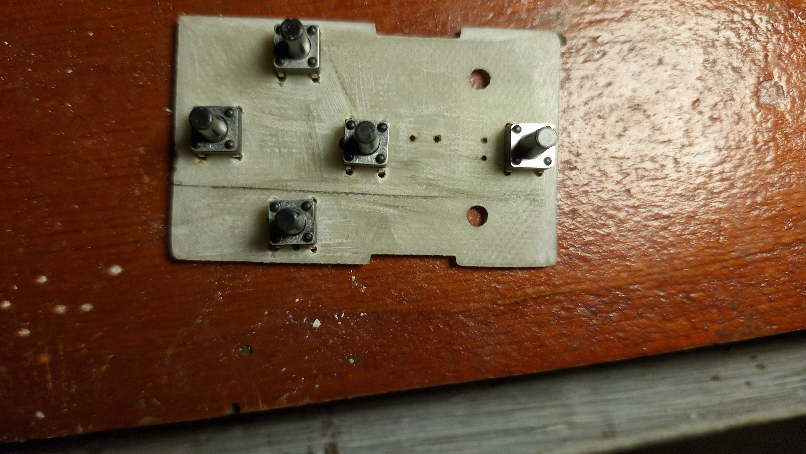
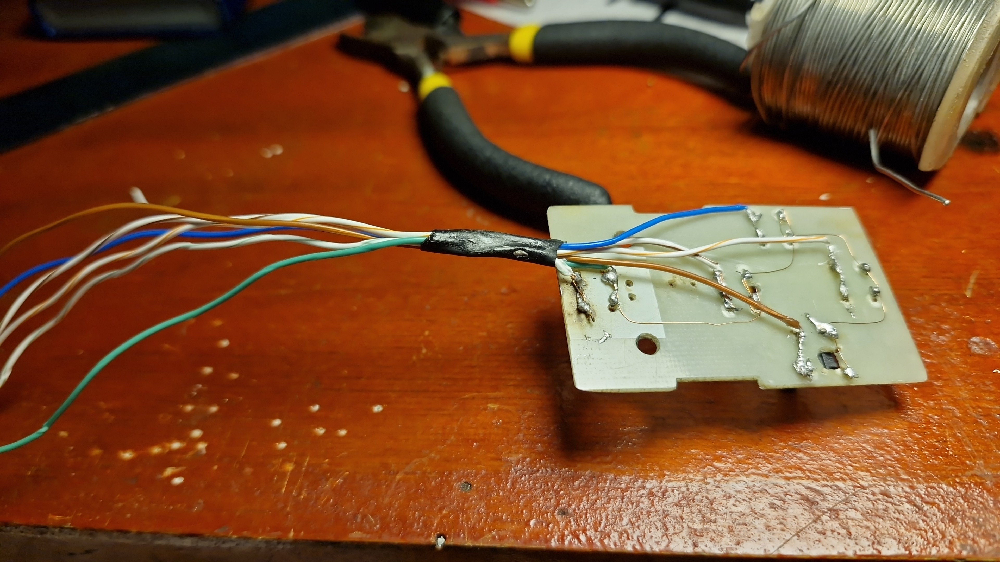

# Informe de Avance 2: Septiembre 202x

## 9/9/2026

No hubo clase

## 16/9/2026

Hoy realizamos trabajo de investigación, documentación y testing de las funcionalidades nuevas.

### Desafíos encontrados

- ****1.0**** Hoy probamos almacenar las respuestas y los alumnos en una base de datos en un maquina virtul rocky linux, el problema es con la conexión del servidor de base de datos y el esp32.
- ****2.0**** No se logró conectar el esp32 con la BD...

### Desafíos resueltos

- ****1.0**** Se resuelve con cambiar el adaptador de red de la maquina virtual de NAT a puente, de ésta forma se reconoce la ip de la VM desde el Sistema Operativo host.

### Tareas completadas

Dejamos andando el sistema de conexión entre el dispositivo del profesor y la esp.

### Futuras tareas

- Testear funcionalidades de la conección a l base de datos.
- Implementar la botonera física

## 23/9/2026

No hubo clase

## 30/9/2026

Hoy implementamos la nueva botonera con su case y los botones andando:

### Desafíos encontrados

* **1.0** Problemas con la implementación de la botonera, en el código (los cambles de los botones y los pines no tenían un orden), el botón de confirmar no funcionaba.  
* **2.0** Problemas con la selección de alumnos antes de empezar el examen.
### Desafíos resueltos

* **1.0** Acomodar los cables de la botonera para hacer match con los botónes.
* **2.0** Botón UP en falso contacto.

### Proximos pasos

Ya mandamos a imprimir el case oficial del proyecto

### Imagenes relevantes

**(Parte delantera de la botonera)**

**(Parte trasera de la botonera)**

## Nota

En este enlace encontrarás un [ejemplo como debe completarse el informe de avance](avance_ejemplo.md).
