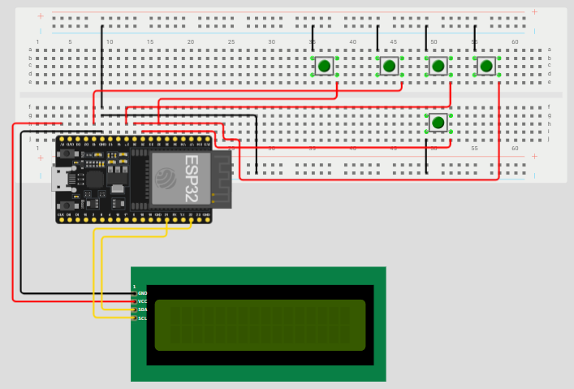

# Documentación Técnica

Este documento contiene la documentación técnica para el proyecto STEAM del curso **Laboratorio STEAM+** de la tecnicatura **Redes y Software** del Instituto Superior Brazo Oriental de **UTU** año 2026.

# Proyecto: \*AUTOEXAMEN

## 1. Integrantes

- Elian Gutierrez
- Nicolas Rodriguez
- Richard Rodriguez
- Agustin Silva

## 2. Descripción

- Se trata de un dispositivo basado en micro-bit el cual automatice la corrección de examenes de múltiple opción, brindando una capa intermedia entre el papel y los dispositivos inteligentes (de los cuales se puede copiar facilmente).
- Buscamos crear un dispositivo que se encuentre entre el mundo digital de los formularios por computadora y el mundo a papel, eliminando el error humano y el tiempo de corrección, agilizando procesos y en el camino ahorrando en costos e impacto ambiental en el uso del papel.

## 3. Materiales

- `ESP-32 DEV KIT 1.0`, `botones`, `batería`, `carcasa`, `pantalla lcd 1202`, `cables`, `protoboard`.

## 4. Diseño Mecánico

- [Realizar una descripción de cómo funciona la solución a nivel mecánico]
- [¿Cómo se arma la solución? Incluir instrucciones de ensamblaje]
  - [Sugerencia: inspirarse en la forma como https://www.instructables.com detalla el armado de un proyecto]
- [Incluir fotografías ilustrativas]

## 5. Diseño Electrónico

- [Realizar una descripción de como funciona la solución a nivel electrónico]
- [Incluir diagramas de Tinkercad mostrando los componentes electrónicos y como van conectados]

## 6. Diseño Software

- [Realizar una descripción de como funciona la solución a nivel de software]
- [Explicar los bloques de código más importantes de la solución programada]
- [Incluir código fuente de python (u otro lenguaje)]
  - [El código debe almacenarse en una carpeta dentro del repositorio]
  - [Sugerencia: almacenar el código en diferentes etapas para mostrar su evolución]

## 7. Referencias y recursos

### 7.1 Diagrama fase de desarrollo esp32

Diagrama de esp en la protoboard con la botonera (diagrama fiel a la realidad)

## 8. Especificaciónes de la esp32

| Método de Alimentación / Pin | Tensión de Entrada Permitida      | ¿Tiene Protección? / Notas                                               |
| ------------------------------ | ---------------------------------- | -------------------------------------------------------------------------- |
| Puerto USB (Micro/Tipo C)      | 5V                                 | Sí. Pasa por un regulador interno que la reduce a 3.3V.                   |
| Pin VIN (o 5V)                 | 4.8V a 12V (Recomendado: 5V a 9V)  | Sí. El regulador a bordo tolera picos, pero voltajes altos generan calor. |
| Pin 3.3V                       | 3.0V a 3.6V (Exacto: 3.3V)         | No. Va directo al chip; más de 3.6V quema el ESP32.                       |
| Pines GPIO (Entradas/Salidas)  | 0V a 3.3V (Máximo absoluto: 3.6V) | No toleran 5V. Usar sensores de 5V requiere divisores de tensión.         |

[Incluir cualquier otra información que consideren relevante para el proyecto]

---

## Diagrama de la conexiónes importantes

**pines de 1602 I2C con esp32:**

| 1602 I2C | esp32 |
| :------: | :---: |
|   GND   |  GND  |
|   VCC   |  VN  |
|   SDA   |  d21  |
|   SCL   |  d22  |

**pines de la botonera al esp32**

| botonera | esp32 |
| :-------: | :---: |
|   SUBIR   |  d25  |
|   BAJAR   |  d27  |
| CONFIRMAR |  d32  |
| IZQUIERDA |  d26  |
|  DERECHA  |  d13  |

---

### Usuario de prueba del lógin del profesor

usuario de prueba: **ruso**
contraseña: **ruso2026**
